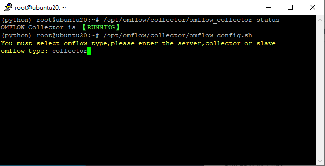
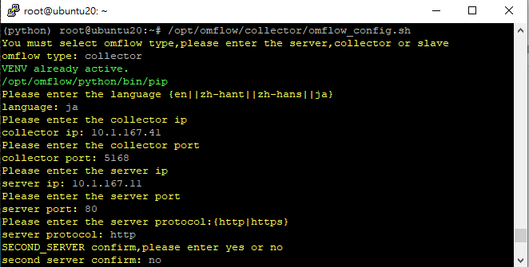
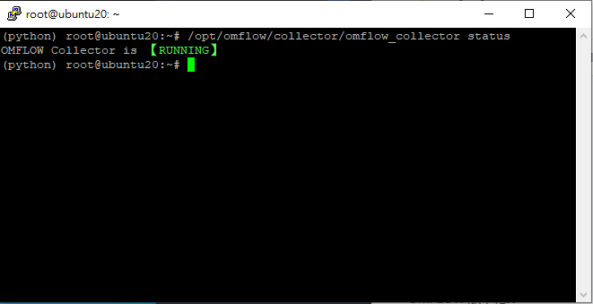

# 安裝在 Linux

## Linux版本安裝 <a href="#linux-ban-ben-an-zhuang" id="linux-ban-ben-an-zhuang"></a>

## **開始安裝 OMFLOW Server** <a href="#kai-shi-an-zhuang-omflow-server" id="kai-shi-an-zhuang-omflow-server"></a>

OMFLOW Server 安裝前環境準備，

本文件以Ubuntu 16.04 , 20.04 和 CentOS 8(若無特別標示Ubuntu版本，則為一樣的步驟)，

Python 版本為3.8.x為範例，

其他作業系統請參考下列準備步驟完成準備。

### 第一步驟，必須準備 Python3 的環境及 OMFLOW 套件 <a href="#di-yi-bu-zhou-bi-xu-zhun-bei-python3-de-huan-jing" id="di-yi-bu-zhou-bi-xu-zhun-bei-python3-de-huan-jing"></a>

Ubuntu 16.04 Python 及必要套件安裝範例

( 請注意是否有使用到原先的 Python，<mark style="color:red;">**建立虛擬環境時請使用正確的 Python**</mark> )

```
add-apt-repository ppa:jonathonf/python-3.8
add-apt-repository ppa:deadsnakes/ppa
apt-get update -y
apt-get install -y python3.8 python3.8-dev apache2-dev python3-venv python3.8-venv
```


<mark style="color:red;">**Ubuntu 16.04若有使用到環境中原有 Python，請斟酌考量以下操作。**</mark>

刪除原先的 Python(請視環境中Python的版本做刪除)

apt remove -y python3.5-minimal python3.5 python2.7&#x20;

將 Python 3.8 設定為預設Python

update-alternatives --install /usr/bin/python3 python /usr/bin/python3.8 1


Ubuntu 20.04 必要套件安裝範例

```
apt-get update -y
apt-get install -y python3.8-dev apache2-dev python3-venv python3.8-venv
```

CentOS Python 及必要套件安裝範例&#x20;

```
dnf -y install python38 gcc httpd-devel python38-devel redhat-rpm-config
```

### 第二步驟，安裝網頁伺服器 Apache Server <a href="#di-er-bu-zhou-an-zhuang-wang-ye-si-fu-qi-apache-server" id="di-er-bu-zhou-an-zhuang-wang-ye-si-fu-qi-apache-server"></a>

Ubuntu 安裝 Apache 範例 &#x20;

```
apt-get install apache2
```

CentOS 安裝 Apache 範例&#x20;

```
dnf install httpd
```

### 第三步驟，建立 OMFLOW 的 Python 執行環境 <a href="#di-si-bu-zhou-jian-li-omflow-de-python-zhi-hang-huan-jing" id="di-si-bu-zhou-jian-li-omflow-de-python-zhi-hang-huan-jing"></a>

```
mkdir /opt/omflow
python3 -m venv /opt/omflow/python
```

### 第四步驟，安裝 Python 必要套件 <a href="#di-wu-bu-zhou-an-zhuang-omflow-bi-yao-tao-jian" id="di-wu-bu-zhou-an-zhuang-omflow-bi-yao-tao-jian"></a>

進入虛擬環境並安裝必需套件

```
source /opt/omflow/python/bin/activate
pip install django==2.2 ldap3 mod_wsgi
```

### 第五步驟，解壓縮 omflow 資料夾 <a href="#di-liu-bu-zhou-jie-ya-suo-omflow-zi-liao-jia" id="di-liu-bu-zhou-jie-ya-suo-omflow-zi-liao-jia"></a>

解壓縮 /tmp/omflow.tar.gz&#x20;

```
cd /opt/omflow 
tar zxvf /tmp/omflow.tar.gz
```

重新命名資料夾 為 **server**

```
mv /opt/omflow/omflow /opt/omflow/server
```

### 第六步驟，資料庫準備 <a href="#di-qi-bu-zhou-zi-liao-ku-zhun-bei" id="di-qi-bu-zhou-zi-liao-ku-zhun-bei"></a>

資料庫目前預設為 SQLite 如要選擇其它資料庫，請參考網址&#x20;

[Django database config](https://docs.djangoproject.com/en/2.2/ref/databases/)

#### Linux安裝資料庫套件對照表:

#### UBUNTU

| **MySQL**                                                                                                                                                                                                                                                                                                         |   |
| ----------------------------------------------------------------------------------------------------------------------------------------------------------------------------------------------------------------------------------------------------------------------------------------------------------------- | - |
| <p>apt update -y &#x26;&#x26; apt upgrade -y <br>apt -y install software-properties-common <br>add-apt-repository 'deb <a href="http://archive.ubuntu.com/ubuntu">http://archive.ubuntu.com/ubuntu</a> bionic main' <br>apt update -y <br>apt install -y python-mysqldb <br>apt install -y libmysqlclient-dev</p> |   |

#### CentOS

| SQLite                |   |   |
| --------------------- | - | - |
| dnf install -y sqlite |   |   |

如果您要選擇其他的資料庫 ，請預先建立好資料庫以給予相對應的權限。 \
以下資料庫需要安裝額外的套件(使用 pip 安裝)


**要安裝資料庫套件前請先進入虛擬環境**`source /opt/omflow/python/bin/activate`


#### 必要套件對照表:

|    PostgreSQL   |   Oracle   |    SQL Server    | MySQL       |
| :-------------: | :--------: | :--------------: | ----------- |
| psycopg2-binary | cx\_Oracle |   django-mssql   | pymysql     |
|                 |            |   django-pytds   | mysqlclient |
|                 |            | django-sqlserver |             |
|                 |            |   django-pyodbc  |             |

**更改 /opt/omflow/server/omflow/settings.py 檔案**\
**以下是 settings.py 修改範例**

**SQLite** `DATABASES = { "default": { "ENGINE": "django.db.backends.sqlite3", "NAME": os.path.join(BASE_DIR, "db.omflow"), "OPTIONS": {"timeout": 300,} } }`

**PostgreSQL** `DATABASES = { "default": { "ENGINE": "django.db.backends.postgresql", "NAME": "<資料庫名稱>", "USER": "<使用者名稱>", "PASSWORD": "<密碼>", "HOST": "<資料庫IP>", "PORT": "<資料庫PORT>", "OPTSIONS":{"connect_timeout":300} } }`

**MySQL** `DATABASES = { "default": { "ENGINE": "django.db.backends.mysql", "NAME": "<資料庫名稱>", "USER": "<使用者名稱>", "PASSWORD": "<密碼>", "HOST": "<資料庫IP>", "PORT": "<資料庫PORT>", "OPTSIONS":{"connect_timeout":300} } }`

**Oracle** `DATABASES = { "default": { "ENGINE": "django.db.backends.oracle", "NAME": "<資料庫名稱>", "USER": "<使用者名稱>", "PASSWORD": "<密碼>", "HOST": "<資料庫IP>", "PORT": "<資料庫PORT>" } }`

**SQL Server** `DATABASES = { "default": { "ENGINE": "sql_server.pyodbc", "NAME": "<資料庫名稱>", "USER": "<使用者名稱>", "PASSWORD": "<密碼>", "HOST": "<資料庫IP>", "PORT": "<資料庫PORT>", "OPTIONS":{"driver":"","MARS_Connection": True,} } }`

### 第七步驟，執行 omflow\_config.sh 檔案 <a href="#di-ba-bu-zhou-zhi-hang-omflowconfigsh-dang-an" id="di-ba-bu-zhou-zhi-hang-omflowconfigsh-dang-an"></a>

進入到 /opt/omflow/server 資料夾&#x20;

```
cd /opt/omflow/server 
./omflow_config.sh
```


若 Python 版本不是 3.8，請在 /opt/omflow/server/omflow/settings.py 中，將 3.8 修改為使用的版本


### 第八步驟，類型選擇為 server <a href="#di-jiu-bu-zhou-lei-xing-xuan-ze-wei-server" id="di-jiu-bu-zhou-lei-xing-xuan-ze-wei-server"></a>

> omflow type : server

#### Ubuntu 執行範例 <a href="#ubuntu-zhi-hang-fan-li" id="ubuntu-zhi-hang-fan-li"></a>


#### 啟用 django.conf 設定檔 <a href="#qi-yong-djangoconf-she-ding-dang" id="qi-yong-djangoconf-she-ding-dang"></a>

執行檔已經幫您把 django.conf (apache設定檔) 複製到 apache 資料夾 \
可以用指令檢視&#x20;

Ubuntu 檢視

```
vi /etc/apache2/sites-available/django.conf
```

CentOS 檢視

```
vi /etc/httpd/conf.d/django.conf
```

Ubuntu 啟用 django.conf 設定檔&#x20;

```
sudo a2ensite django.conf
```

Ubuntu 停用 apache 預設檔

```
sudo a2dissite 000-default.conf
```

### 第九步驟，omflow\_server 服務 <a href="#di-shi-bu-zhou-qi-yong-omflowserver-fu-wu" id="di-shi-bu-zhou-qi-yong-omflowserver-fu-wu"></a>

啟動 omflow\_server 服務&#x20;

```
/opt/omflow/server/omflow_server start
```

停用 omflow\_server 服務

```
/opt/omflow/server/omflow_server stop
```

確認 omflow\_server 服務狀態

```
/opt/omflow/server/omflow_server status
```

### 第十步驟，開始享用 OMFLOW <a href="#di-shi-yi-bu-zhou-kai-shi-xiang-yong-omflow" id="di-shi-yi-bu-zhou-kai-shi-xiang-yong-omflow"></a>

## 開始安裝OMFLOW Collector <a href="#kai-shi-an-zhuang-omflow-collector" id="kai-shi-an-zhuang-omflow-collector"></a>

### 第一步驟，必須準備 Python3 的環境 <a href="#di-yi-bu-zhou-bi-xu-zhun-bei-python3-de-huan-jing" id="di-yi-bu-zhou-bi-xu-zhun-bei-python3-de-huan-jing"></a>

Ubuntu 安裝範例&#x20;

```
apt-get install python3
```

CentOS 安裝範例&#x20;

```
yum install python3
```

### 第二步驟，建立 OMFLOW 的 Python 執行環境 <a href="#di-si-bu-zhou-jian-li-omflow-de-python-zhi-hang-huan-jing" id="di-si-bu-zhou-jian-li-omflow-de-python-zhi-hang-huan-jing"></a>

```
mkdir /opt/omflow
python3 -m venv /opt/omflow/python
```


如果無法建立虛擬環境，請安裝套件`apt-get install python3-venv`


### 第三步驟，安裝 OMFLOW 必要套件 <a href="#di-wu-bu-zhou-an-zhuang-omflow-bi-yao-tao-jian" id="di-wu-bu-zhou-an-zhuang-omflow-bi-yao-tao-jian"></a>

進入虛擬環境並安裝必需套件

```
source /opt/omflow/python/bin/activate
pip install django==2.2
```


其他非必要套件視 Collector 實際用途有所不同，可至[收集器套件](../5/5.md#shou-ji-qi-tao-jian)觀看說明。


第四步驟，解壓縮 omflow 資料夾

解壓縮 /tmp/omflow.tar.gz&#x20;

```
cd /opt/omflow 
tar zxvf /tmp/omflow.tar.gz
```

重新命名資料夾 為 **collector**

```
mv /opt/omflow/omflow /opt/omflow/collector
```

### 第五步驟，執行 omflow\_config.sh 檔案 <a href="#di-ba-bu-zhou-zhi-hang-omflowconfigsh-dang-an" id="di-ba-bu-zhou-zhi-hang-omflowconfigsh-dang-an"></a>

進入到 /opt/omflow/collector 資料夾&#x20;

```
cd /opt/omflow/collector 
./omflow_config.sh
```

### 第六步驟，類型選擇為 collector <a href="#di-liu-bu-zhou-lei-xing-xuan-ze-wei-collector" id="di-liu-bu-zhou-lei-xing-xuan-ze-wei-collector"></a>

> omflow type : collector



### 第七步驟，輸入必填資訊 <a href="#di-qi-bu-zhou-shu-ru-bi-tian-zi-xun" id="di-qi-bu-zhou-shu-ru-bi-tian-zi-xun"></a>

此步驟將會更改 **/opt/omflow/collector/omflow/settings.py**

* **Collector IP : 本機IP**
* **Collector port : 5168**
* **Server IP : OMFLOWserver IP**
* **Server port : OMFLOWserver port**
* **Server protocol : OMFLOW server protocol**



### 第八步驟，omflow\_collecter 服務 <a href="#di-ba-bu-zhou-qing-jian-cha-omflowcollecter-fu-wu-zhuang-tai" id="di-ba-bu-zhou-qing-jian-cha-omflowcollecter-fu-wu-zhuang-tai"></a>

啟動omflow\_collector 服務

```
/opt/omflow/collector/omflow_collector start
```

停止omflow\_collector 服務

```
/opt/omflow/collector/omflow_collector stop
```

確認 omflow\_collector 服務狀態

```
/opt/omflow/collector/omflow_collector status
```



## 開始安裝 OMFLOW Patch

### 第一步驟，解壓縮 Patch檔

```
tar xvf omflow_patch_1_x_x_x.tar.gz
```

### 第二步驟，執行 patch.sh

```
cd omflow_patch_1_x_x_x/
./patch.sh
```

