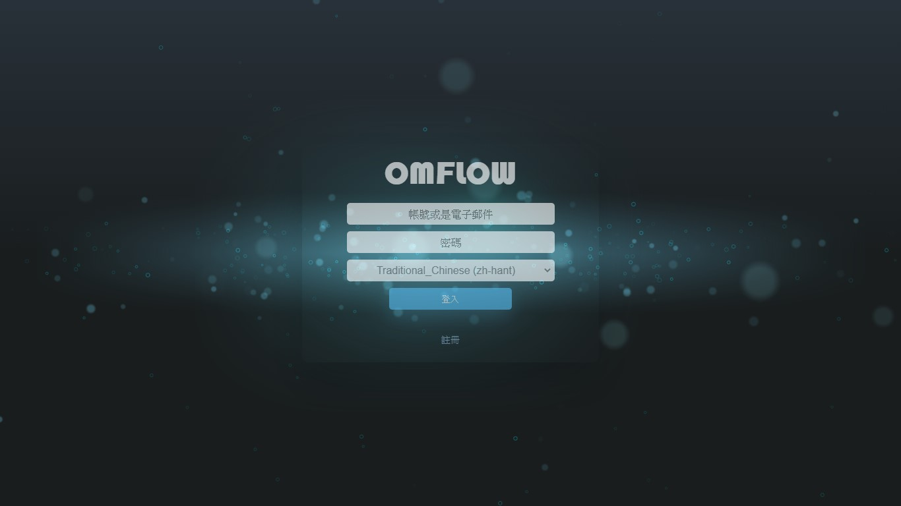
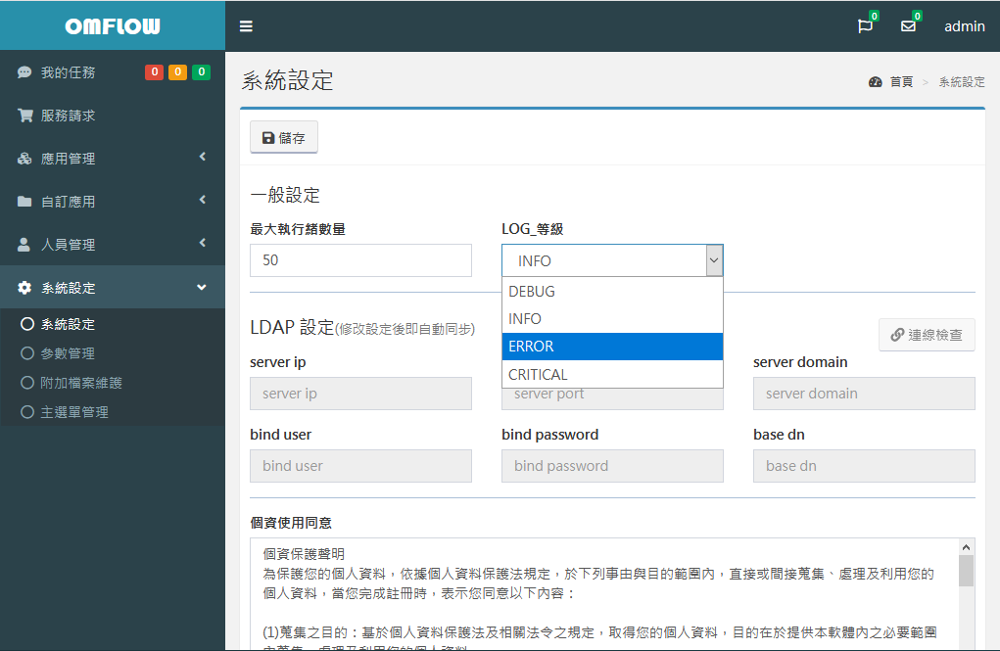

# 初始設定

## STEP 1 登入系統

依據上個章節啟動系統後，可以使用瀏覽器進入系統畫面\(http://127.0.0.1:80\)，開源版使用預設的帳號密碼登入，免費版及企業版請使用註冊功能註冊第一個帳號，系統會將第一個註冊的帳號登錄為系統管理員。

## STEP2 修改預設密碼

系統剛啟用後，建議先修改預設的管理者密碼，點擊右上角admin，可以看到個人資料/更改密碼/登出的視窗，點選更改密碼按鈕

即可進入更改密碼介面，輸入原始的密碼以及新的密碼後即可變更。變更後系統會將您登出，請使用新密碼登入。

## STEP3 設定Log等級

進入 _**系統設定&gt;系統設定**_  中，設定系統Log為ERROR等級，避免過多的Log產生。當系統發生異常需要除錯時，可將LOG等級設定為DEBUG以印出完整的LOG，LOG存放在OMFLOW目錄的LOG資料夾中。

預設的LOG設定是每天1個LOG檔案，最多存放10天。

`說明: 若要變更此設定，可以修改omflow/settings.py中的LOGGING設定。`

系統設定下方的個資使用同意及軟體使用同意，可以供您自訂自己的條款，這些條款在新使用者註冊時必須同意才能註冊帳號。

## STEP4 選單編排

_**系統設定&gt;主選單管理**_ 可以供管理者編排左方選單的順序，請使用拖拉的方式進行編排，編排完畢後儲存即可立即生效。

