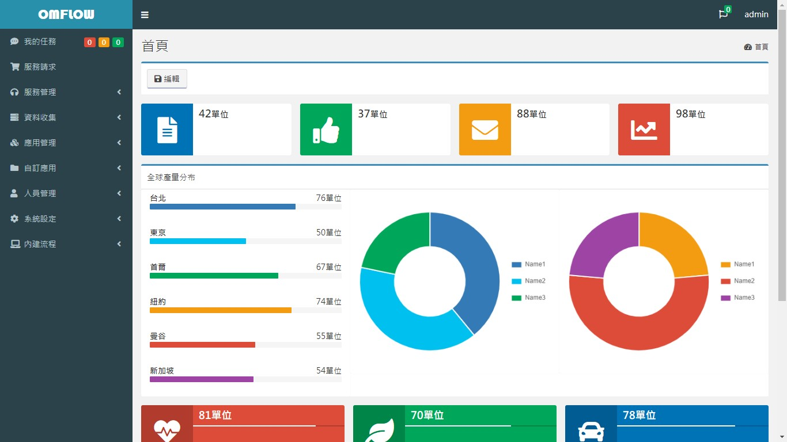

# ホーム

## 個人情報

ページの右上隅にあるユーザー名をクリックすると、小さなウィンドウが開き、次の機能が表示されます。

1. **個人情報**：クリックして個人情報ページに入ります。詳細は[**機能説明書&gt;ユーザー管理**](https://doc.omflow.com.tw/v/japan/5/8)をご覧ください
2. **パスワードを変更する**：個人用パスワードを変更します。パスワードルールは大文字と小文字の1つ、全長は少なくとも8コードです
3. **ログアウト**：ユーザーをログアウト

## エージェント

従業員が現在利用できるすべてのユーザーを表示します。ユーザーを選択すると、ユーザーが使用できるフォームを操作したり、請求やプッシュなどのアクションを実行したりできます。

ユーザーがエージェントの場合、Webページの右上隅にプロンプトが表示されます。クリックすると、すべてのエージェントと関連タスクのサービスレベルを表示できます。 エージェントの名前をもう一度クリックすると、エージェントモードに切り替えて、関連業務の処理をサポートできます。

## 言語切り替え

個人情報の横にある地球のアイコンをクリックして、ドロップダウンメニューを、表示する言語バージョンを選択して切り替えます。


ユーザーが入力したコンテンツの一部を言語に切り替えることができないため、切り替えた言語を表示する前に、アプリ管理やサービス要求の翻訳パッケージをインポートできます。


## ホーム

このシステムの主要な機能はすべて左側に表示されます。各ログインユーザーの表示権限に応じて、メインメニューには対応する項目のみが表示されます。以下に各項目の概要を示します。詳細については、次の項目をクリックしてください。

* [**私のミッション**](2.md)：受信または進行を便利にするために、ユーザー自身に関連するすべてのタスクを収集します。
* [**サービスリクエスト**](3.md)：一般ユーザーがサービスをリクエストするためのインターフェースを提供します。
* [**サービス管理**](4.md)：商用バージョンは、インシデント管理、問題管理、および変更管理に関連する機能を提供します。
* [**データ収集**](5.md)：商用バージョンが機能し、監視または分散コンピューティング用のコレクターを展開します。
* [**アプリ管理**](6.md)：アプリケーションフローを設計します。
* [**APPS**](7.md)：ユーザーが設計した申請フローで生成された各種データを保存します
* [**ユーザー管理**](8.md)：アカウント、グループ、ロールに関する情報を管理します。
* [**システム設定**](9.md)：システム関連の機能を設定します。
* [**デフォルトフロー**](10.md)：商用バージョンは、メール送信などの一般的なアプリケーションフローを提供します。

## ダッシュボード

ダッシュボードは各アプリケーションフローのフィールド値を統合して表示でき、各グラフの更新頻度は1分です。次に、専用ダッシュボードの設計方法を紹介します。

ダッシュボードの上部にある編集ボタンをクリックして編集モードに入ると、次のようにボタンが右側に順番に表示されます。

1. **保存する**：この編集内容を保存して、編集モードを終了します。
2. **キャンセル**：この編集内容をキャンセルして、編集前の状態に戻します。
3. **ブロック**：新しいブロックを追加して、ダッシュボードの幅を分割します。合計幅は1です。たとえば、ダッシュボードの同じ高さで4つのグラフィックを同時に表示する場合は、4つの1/4ブロックを追加して、各ブロックにグラフィックを追加できます。

各ブロックの上に、次の順序で3つのボタンがあります。

1. **作成**：さまざまなグラフィックを追加し、表示、測定ストリップ、世界地図、折れ線グラフ、棒グラフ、円グラフを表示します。1つのブロックに、他のサイズのブロックを追加できます。
2. **設定**：ブロック名と線の色を設定します。名前が設定されていない場合、タイトルと線は非表示になります
3. **削除**：ブロックを削除

各グラフの上には、次の順序で2つのボタンがあります。

* **設定**：「一般設定、データ設定」に分かれており、オプションは以降に紹介されます。
* **削除**：グラフィックを削除する

データ設定、検索するデータまたはテキストを設定します。

* **フォーム検索**：ユーザー、グループ、ロール、その他のアプリケーションフローを選択する
* **フィールド検索**：選択したフォームの全フィールドを検索できます（単一選択）
* **時間範囲**：検索する際の本日、先週などのデータの時間範囲（更新時間）を指定します...
* **種類**：最新の値、平均、最大値、最小値などの検索を分類します...
* **分類**：選択したフォームの特定のフィールドを、検索値による\(group by\)の基準として使用します

高度な設定、グラフィックの外観スタイルを設定します。

* **タイトル**：テキストを入力してください。空白の場合、ラベルは非表示になります
* **説明**：グラフィックをアシストする説明を入力します。
* **アイコン**：アイコンを選択して、グラフィックをアシストします。
* **色**：色を選択してください。
* **単位**：文字を入力すると、検索値の右側に表示されます。
* **高さ\(px\)**：数値を入力して図の高さを指定します。
* **数値上限**：番号を入力して、測定ストリップに適用します。
* **データ初期の色**：棒グラフなど、複数のクエリ値を生成するグラフィックの場合、棒の色は初期色から変更され、変更順序は「青、水色、緑、黄色、赤、紫、グレー、ディープグレー」になります。

