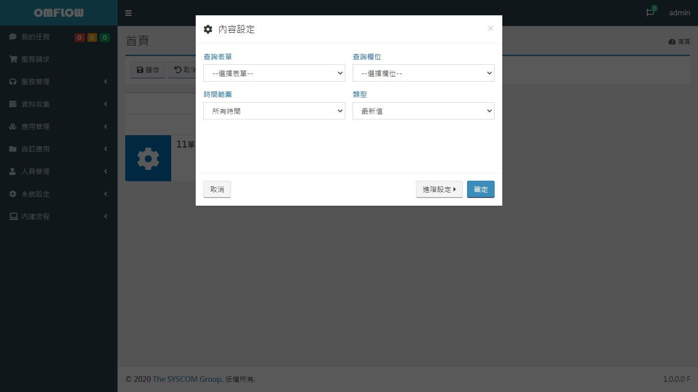

# Home

## Personal information

Click on the user name in the upper right corner of the page, and a small window will open with the following functions:

1. **Personal information:**Click to enter the profile page, please refer to[ _**FEATURES&gt;Staff Management**_](8.md#user-management) \__\*\*_\_for details
2. **Change password:**Change the personal password, the password rule is one uppercase and lowercase English numbers, and the total length is at least 8 codes
3. **Sign out:**User logout

## Language

Click the globe icon next to your personal information to expand the drop-down menu and select the language version to be displayed to switch.


Part of the content entered by the user cannot be switched to the language. The application management and service request can be imported into the translation package by the user before the switched language can be displayed.


## Substitute

Displays all the users currently available for the employee. After selecting the user, you can operate the forms that the user can use, and perform actions such as billing and pushing.

When the user is an agent, a prompt will be displayed in the upper right corner of the webpage. After clicking, you can view the service level of all agents and related tasks. If you click the agent's name again, you can switch to agent mode and assist in handling related affairs.

## Main menu

All the major functions of this system are displayed on the left. According to the viewing authority of each login user, the main menu will only display the corresponding items. The following will give a brief introduction to each item. For details, click the following items:

* \*\*\*\*[**My Mission**](2.md)：Collect all tasks related to the user himself to facilitate reception or advancement.
* \*\*\*\*[**Service Request**](3.md)：Provide an interface for general users to make service requests.
* \*\*\*\*[**Service Management**](4.md)：The enterprise version provides functions related to incident management, problem management, and change management.
* \*\*\*\*[**Data Collection**](5.md)：Enterprise version functions, deploy collectors for monitoring or distributed computing.
* \*\*\*\*[**Application Management**](6.md)：Design various application flow.
* \*\*\*\*[**Report**](bao-biao.md)：Commercial version features, design and export all kinds of reports.
* \*\*\*\*[**APPs**](7.md)：Store various data produced by the application flow designed by the user
* \*\*\*\*[**Staff Management**](8.md)：Manage information about accounts, organizations, and roles.
* \*\*\*\*[**System Setting**](9.md)：Set system-related functions.
* \*\*\*\*[**Default Flow**](10.md)：The enterprise version provides common application flow such as email sending.

## Dashboard

The dashboard can integrate and display the field values of each application flow. The update frequency of each graph is one minute. The following will introduce how to design a dedicated dashboard.

Click the edit button at the top of the dashboard to enter the edit mode, and buttons will appear in sequence on the right, as follows:

1. **Save:** Save this editing content and leave the editing mode.
2. **Cancel:** Cancel the editing content and return to the state before editing.
3. **Block:** Add a new block to divide the width of the dashboard, with a total width of 1. For example, if you want to display 4 graphics at the same height of the dashboard at the same time, you can add four 1/4 blocks and add new ones in each block Add one figure.

There will be three buttons above each block, in order as follows:

1. **New:** Add various graphics, display text, metering bar, water pipe chart, line chart, bar chart, pie chart, and other size blocks can be added in one block.
2. **Setting:** Set the block name and line color, if the name is not set, the title and line will be hidden
3. **Delete:** Remove block

There will be two buttons above each graph, in order as follows:

* **Settings:** Divided into "general settings, data settings", the options will be further introduced below.
* **Delete:** delete graphics

Data setting, set the data or text you want to query.

* **Query form:** select users, organizations and roles, and other application flow
* **Query field:** query all fields of the selected form \(single choice\)
* **Time range:** Specify the data time range \(update time\) when querying, such as today, last week...
* **Type:** sort the query value, such as: latest value, average value, maximum value, minimum value, etc...
* **Classification:** select the specific field of the selected form as the basis for group by the query value

Advanced settings, set the graphic appearance style.

* **Title:** Enter text, the title will be hidden when it is blank.
* **Description:** Enter a description to assist the graphics.
* **Icon:** Select the icon to assist the graphics.
* **Color:** Choose a color.
* **Unit:** Enter the text and it will be displayed on the right side of the query value.
* **Height \(px\):** Enter a number to specify the height of the graphic. 
* **Upper limit of value:** input a number and apply it to the metering bar and water pipe diagram.
* **Data start color:** For graphics that generate multiple query values, such as a bar graph, the color of the bar will be changed according to the start color, and the change order is "blue, cyan, green, yellow, red, purple, gray, dark gray".

