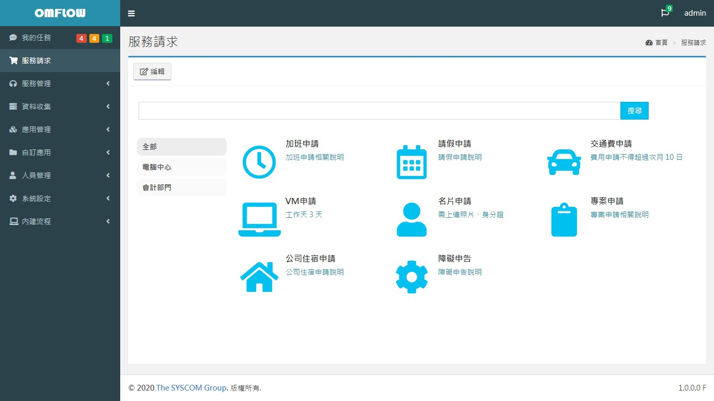
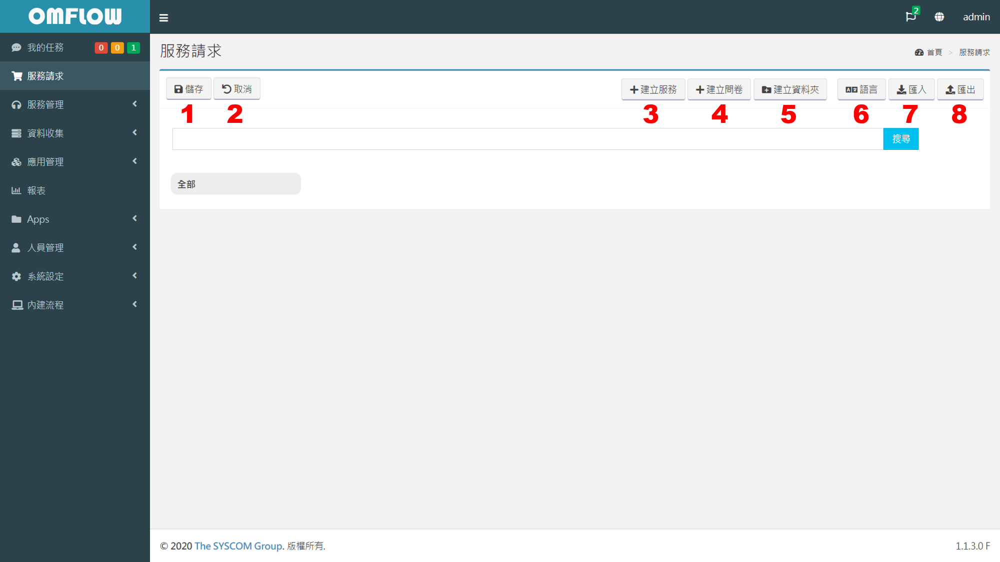

# 服務請求

當 [_**應用管理 &gt; 應用設計**_](6.md#ying-yong-she-ji) 上架完畢時，可能因權限限制而導致使用者無法自行填單，又或表單欄位繁多難以提供一般使用者填寫。為此，服務請求介面可針對指定表單流程提供步驟化、簡易化的填單介面。

## 編輯模式

超級使用者或擁有「服務請求管理」權限之使用者，在點擊「編輯」後即可進入編輯模式，並產生下列按鈕：

1. **儲存**：儲存當前設計內容。
2. **取消**：取消當前設計內容，還原至最後一次儲存的設計內容。
3. **建立服務**：建立一個服務。
4. **建立問卷**：建立一個問卷。
5. **建立資料夾**：建立一個資料夾，可將其他服務移入資料夾。
6. **語言**：將當前設計內容的語言翻譯包匯入或匯出。
7. **匯入**：匯入設計並覆蓋當前設計內容。
8. **匯出**：匯出最後一次儲存的設計內容。

## 建立服務

點擊「建立服務」，並選擇應用流程 \( 該流程在服務請求被提出後，系統將自動開單執行流程程序 \)，建立後點擊服務即可進入編輯介面。

1. **一般設定**：可設定服務的顯示名稱、說明、圖示等設定，其中「服務對象」可限制那些角色可以使用此服務。
2. **步驟設計**：可新增欄位及新增步驟，其中新增欄位來自選用的應用流程[表單欄位](6.md#xin-jian-bian-ji-liu-cheng-ye-mian-biao-chan-she-ji)，此處新增的步驟及欄位都會被一般使用者使用。
3. **預設值**：可新增欄位，欄位同樣來自選用的應用流程表單欄位，在使用者送出服務請求時，系統會整合預設值進行自動開單。


預設值欄位填入的值視為最終結果，將無視子查詢及計算等連動效果。



所有**必填欄位**須加入至「步驟設計」或「預設值」頁籤內，以確保服務能正確執行。


## 建立問卷

點擊「建立問卷」，在建置的操作流程上與「建立服務」並無差異，但服務的對象並非OMFLOW的使用者，而是提供給未登入的訪客填寫，填寫完畢後即會進行開單，以下有幾點須注意：

* **公開網址**：提供訪客連結，在建置時可以在「一般設定」頁籤看到「公開網址」欄位，如下圖：

* **對象為非OMFLOW使用者**：所有問券皆不會出現一般使用者的服務介面上。
* **限制部分欄位使用**：由於允許任何未登入的對象使用，基於資安保護的目的，設計者在「步驟設計」頁籤上不允許加入「子查詢、受派組織、組織、使用者、上傳檔案」等欄位。但「預設值」頁籤並不受此限制。

## 建立資料夾

點擊「建立資料夾」，會在左側產生「資料夾」項目，資料夾之間也可以拖曳互換位置並有以下特性：

* **全部**：所有服務請求都顯示於此。
* **資料夾**：每個資料夾都可以新增服務或移入服務，點擊資料夾則會切換顯示。

## 語言

點擊「語言」，並選擇要使用的語系後，匯入或匯出翻譯檔，匯出翻譯前若有修改設計，務必先儲存設計後再匯出翻譯檔。

匯出後的翻譯檔打開後，直接在要翻譯的內容下一行輸入翻譯後的內容再儲存即可，匯入翻譯檔前務必選擇正確的語系再匯入對應的翻譯檔。

## 服務失效

當服務所對應的應用流程已經被下架時，服務將無法使用並顯示「下架」，若流程重新上架後將恢復使用。

