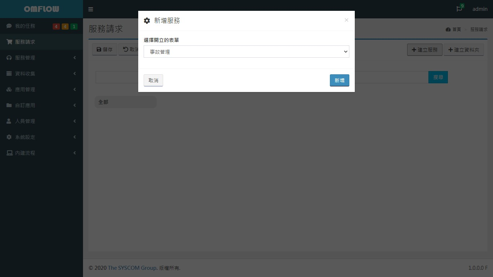

# Service Request

When [_**Application Management&gt;Application Design**_](6.md#ying-yong-she-ji) _\*\*_ has been put on the shelves, users may not be able to fill in the form by themselves due to permission restrictions, or there are too many fields in the form to provide general users to fill out. To this end, the service request interface can provide a step-by-step and simplified form-filling interface for the specified form flow.

## Edit mode

A super user or a user with the "Service Request Management" permission can enter the edit mode after clicking "Edit" and the following buttons will be generated:

1. **Save:** Save the current design content.
2. **Cancel:** Cancel the current design content and restore to the last saved design content.
3. **Create a service:** Create a service.
4. **Create a folder:** Create a folder to move other services into the folder.

## Create service

Click "Create Service" and select the application flow\(after the service request is submitted, the system will automatically issue a bill to execute the flow\), click on the service after creation to enter the editing interface.

1. **General settings:** you can set the display name, description, icon and other settings of the service, among which the "service object" can restrict those roles that can use the service.
2. **Step design:** You can add new fields and new steps. The new fields come from the selected application flow form fields. The new steps and fields here will be used by general users.
3. **Default value:** You can add a field. The field also comes from the selected application flow form field. When the user sends a service request, the system will integrate the default value for automatic billing.


The value entered in the default value field is regarded as the final result, and the linkage effects such as subquery and calculation will be ignored.



All **required fields** must be added to the "Step Design" or "Default Value" tab to ensure that the service can be executed correctly.


## Create folder

Click "Create Folder", a "folder" item will be generated on the left, and you can also drag and swap between folders and have the following characteristics:

* **All:** All service requests are displayed here.
* **Folder:** Each folder can add services or move into services, and click the folder to switch the display.

## Language

Click "Language" and select the language you want to use, then import or export the translation file. If you modify the design before exporting the translation, you must save the design before exporting the translation file.

After the exported translation file is opened, directly enter the translated content in the next line of the content to be translated and save it.

Before importing the translation file, be sure to select the correct language and then import the corresponding translation file.

## Service failure

When the application flow corresponding to the service has been removed, the service will be unavailable and display "Removed". If the flow is re-available, it will be resumed.

