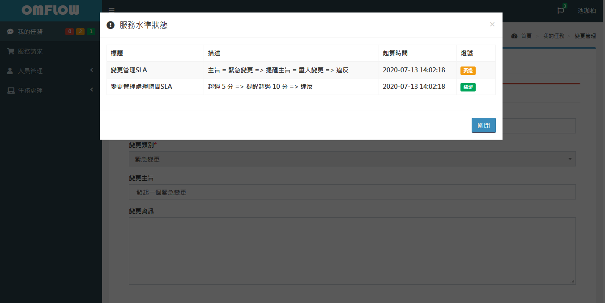

# ユーザー管理

## ユーザー管理

_**ユーザ管理>ユーザ管理**_ に入ると、下記の画面で当システムの全てのユーザの管理を行うことが可能です。ユーザには、管理者、ユーザ、LDAPの3種類があります。デフォルトではシステム管理者は1人だけで、管理者はシステムの全ての権限を制限なしに保持します。その他のユーザは権限制限があり、使用者をロールに割り当てることにより権限を保持するようになります。

#### **ユーザ追加**

**ユーザ管理**_ページの新規ボタンをクリックし、ユーザ情報設定タブに移動後、必須入力欄に入力、保存ボタン押下後、完了ウィンドウが表示されるとユーザ追加完了となります。完了ウィンドウを閉じると_**ユーザ管理**ページに戻ります。_ユーザID_、_パスワード_、_名前_、\_メールアドレス\_は必須入力欄です。ユーザ追加時、\_パスワード\_欄はパスワード設定規則の制限を受けません。

.png>)

#### ユーザ編集

**ユーザ管理**ページで編集するユーザをクリックしてユーザ情報設定タブを表示し、該当ユーザの情報を編集できます。**ただし、ユーザIDは変更することはできません。**

.png>)

ユーザはここで自身のパスワードを変更できません。自身のパスワードを変更するには、パスワードの変更を参照してください。\_ユーザ編集\_権限を有するユーザはここで他のユーザのパスワードを変更することができます。

代理人欄では、一人のユーザを固定の代理人として選択することができます。代理人は、本人に代わり全てのフォーム関連操作できます。また、休暇申請システムでも代理人を選択することが可能です。詳細は代理機構を参照してください。\

.png>)

ユーザが複数のグループに属する場合、デフォルトのグループを設定することができます。プロセスにおいて、デフォルトグループが優先グループとなります。デフォルトグループが未設定の場合は最初のグループをデフォルトグループとして選択します。

通知の更新頻度は、ユーザへの全ての通知およびデータ一覧表の更新頻度で、5～60秒の範囲です。

#### ユーザの有効化/無効化

**ユーザ管理**ページで複数のユーザを選択し、上部の有効化、無効化ボタンでまとめて切り替えることができます。また、一覧表内の状態欄のボタンをクリックすることでも、ユーザの状態を素早く切り替えることができます。

.png>)

.png>)

.png>)

#### ユーザ削除

**ユーザ管理**ページで複数のユーザを選択し、上部の削除ボタンでまとめて削除することができます。

## 休暇申請記録

自身の全ての休暇申請記録を表示します。チェックボックスで表示する休暇申請の状態を指定することができます。

<figure><figcaption></figcaption></figure>

## 代理記録

自身が他のユーザの代理人となった記録を表示します。チェックボックスで表示する代理人記録の状態を指定することができます。

<figure><figcaption></figcaption></figure>

## 役割管理

_**ユーザ管理>役割管理**_ に入ると、次の画面が表示されます。システムの全ての権限はロール（役割）に関連しています。ロールを作成し、適切な権限を付与すると、ロールに属する全てのユーザが、ロールに設定された権限を有するようになります。この権限には、ユーザ、グループ、ロールおよびアプリケーションの参照、追加、削除、編集といった権限も含みます。


**追加、削除、編集の権限を付与し操作するためには、同時に参照権限を付与する必要があります。**


.png>)

#### ロール追加

**新規**ボタンをクリックし、ロール名称と説明を入力し、**確定**ボタンを押下することにより作成が完了します。

#### ロール編集

一覧内の編集対象のロールをクリックしてロール情報の画面を表示してロールの編集を行います。各タブの保存ボタンは独立しているため、編集後は必ず保存を行ってください。

.png>)

.png>)

#### ロール削除

**役割管理**ページで削除対象のロールを選択し上部の削除ボタンで削除を行います。

## グループ管理

_**ユーザ管理>グループ管理**_ に入ると次の画面が表示されます。グループの主な用途は、アプリケーション設計で、フォームの担当グループ、担当ユーザを指定するために使用されます。

.png>)

#### グループ追加

**新規**ボタンを押下し、属するグループ名を選択した後、グループ名と説明を入力し、**確定**ボタンを押下して追加します。所属グループを選択しない場合、ルートグループになります。

#### グループ編集

一覧で編集対象のグループをクリックしてグループ情報を表示して編集を行います。各タブの保存ボタンは独立しているので、編集後は必ず保存ボタンを押下してください。

.png>)

.png>)

#### グループ削除

**グループ管理**\_ページで削除対象のグループを選択肢、上部の削除ボタンでグループを削除します。

## AD参照（無料版/商用版）

**ユーザ管理>AD参照**に入ると次の画面が表示されます。ここでは主にLDAPで取り込んだグループとユーザを確認できます。詳細な設定と作成方法については LDAP設定 を参照してください。

\
職務管理（無料版/商用版） 
----------------------------------------------------------------------------------------------------------

**ユーザ管理>職務管理**に入ると次の画面が表示され、**組織図管理**\_で設定する職務の追加、削除、編集を行うことができます。

.png>)

職務には複数の権限と責任を設定することができ、組織図管理で使用すると、設定された権限と責任を自動的に取り込みます。

<figure><figcaption></figcaption></figure>

## 組織図管理（無料版/商用版） 

**ユーザ管理>組織図管理>企業組織**に入ると次の画面が表示され、必要に応じてグループ、職務、ユーザの項目を追加し、それらを接続して組織図を作成することができます。グループの下に複数の部門および職務を接続できますが、職務の下にはユーザのみが接続可能です。項目の上部の歯車をクリックして、この項目のキーを設定します。

.png>)

**設定**ボタンで対象の組織を管理するグループやユーザを指定します。

.png>)

組織を編集するにはまず組織を選択し、その組織の管理を委託するかどうかを決定します。委託後の組織は**企業組織**_においていかなるグループ、職務、ユーザと接続することもできません。管理を委託されたユーザは、左側のメインメニューの_**ユーザ管理>組織図管理>\[管理受託組織]**からその組織配下の組織図を編集することができます。編集を完了した組織は、保存した後、申請することができます。申請を通過した後、当該組織は企業組織の管理委託先組織の配下に統合されます。

#### グループ設定

グループ管理内のグループを選択した場合、グループの管理を委託後は企業組織上の位置移動しか行えず、該当のグループ及びその配下のグループ、職務、ユーザに係る設定は、管理委譲を取り消すまで実施できません。管理を受託した組織図では、その組織は濃い色で表示されます。
